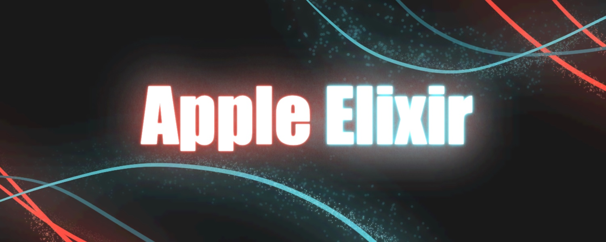
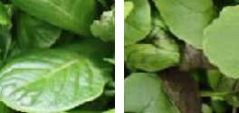

# :memo: About the Project
The scope of this project is to track the progress of the Homeworks for AN2DL at PoliMI accademic year 23-24

<br />

## :book: Homework 1
### :clock3: Deadlines
#### :computer: Dev. Phase - Start: 02/11/2023 - 23:00
#### :triangular_flag_on_post: Final Phase - Start: 15/11/2023 - 23:00
#### :crossed_flags: Competition Ends: 17/11/2023 - 22:59  

<br />

### :dart: Task
Classify plants that are divided into two categories according to their state of health. It is a binary classification problem, so the goal is to predict the correct class label in {0, 1}.


<table style="margin: 0 auto;">
    <tr>
        <th style="width:106px">0 - Healthy</th>
        <th style="width:106px">1 - Unhealthy</th>
    </tr>
</table>

### :floppy_disk: Dataset Details
- Image Size: 96x96
- Color space: RGB
- File Format: npz
- Number of classes: 2
- Classes:
    - 0: "healthy"
    - 1: "unhealthy"

Inside the ./res/npz/ folder you'll find the public_data.npz which contains:
- "data" : 3-dimensional numpy array of shape 5100x96x96x3, containing the RGB images
- "labels" : 1-dimensioanl numpy array of shape 5200 with values in {'healthy', 'unhealthy'}

<br />

To Read the Data use:
```
    numpy.load('public_data.npz', allow_pickle=True)
```
:warning: no automatic validation set is provided.


<br />

### :globe_with_meridians: External Data
#### :white_check_mark: Allowed
- Libraries not seen during lectures and labs (bearing in mind that you will be limited to those selected by us during submission)
- Models pre-trained on imagenet by keras.applications (for transfer learning and/or fine tuning)
#### :x: Not Allowed
- Any source of data that has not been provided by us, especially if to be used for training purposes
- Any pre-trained model not belonging to keras.applications and/or not pre-trained on imagenet 


<br />

### :headphones: Playlist Suggestions

- [Apeiron](https://open.spotify.com/playlist/4n1ospIm5afsGRvWvCt0Ab?si=416f37db8a70413f)
- [Balance](https://open.spotify.com/playlist/4W3rpOJGsJeoEY2HFz3GNf?si=f2be91354aaa4f31)
- [Lair of the white rabbit](https://open.spotify.com/playlist/58m1g8X3E41wU5Do1A5trZ?si=095c94e653c2447f)

<br />

## :round_pushpin: Roadmap
- [ ] Data Cleaning / Data Cleansing :hourglass:
- [ ] Rotate / Reflect the images to enlarge the dataset
- [ ] Choose the Network for the feature exctraction
- [ ] Build the Classifier